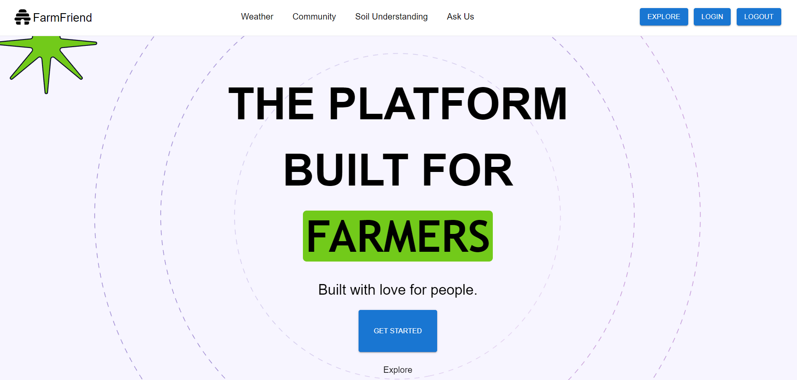

# 
    FARMERS FRIEND

    

### OBJECTIVE : 

    Creating a user-friendly smart agriculture advisory app aimed at providing farmers
    with essential information and recommendations to enhance crop yield and
    efficiency in resource usage


### FEATURES LIST :

1. Weather Forecast Integration
2. Resource Management Tips
3. Community Forum
4. Crop Suitability Assessment


   


# Run Scripts

```Terminal
git clone https://github.com/suryapratap6521/Farmers_Friend.git

cd Farmers_Friend
npm install
npm run dev

cd server
npm install
npm start
```


# Environment Variables

  Create an { .env } file in server directory and add these env variables to run the Code base successfully.

---


```Terminal
PORT=5000
MONGODB_URL = ENTER YOU MONGODB DATABASE CONNECTION STRING

JWT_SECRET= "ENTER YOUR JWT SECRET HERE"

MAIL_HOST = smtp.gmail.com
MAIL_USER= ENTER YOUR EMAIL ADDRESS (FOR MAILING SERVICES)
MAIL_PASS=ewvjaiadwhtpymib

API_KEY = ENTER YOUR GOOGLE STUDIO API KEY
```
